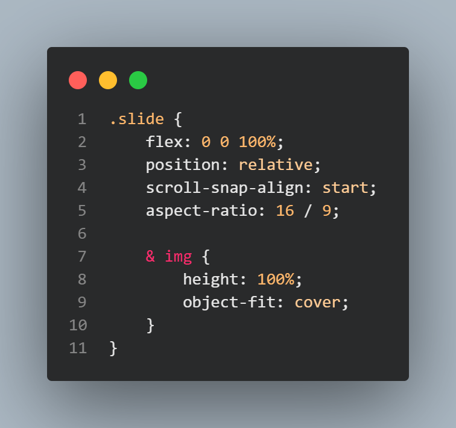
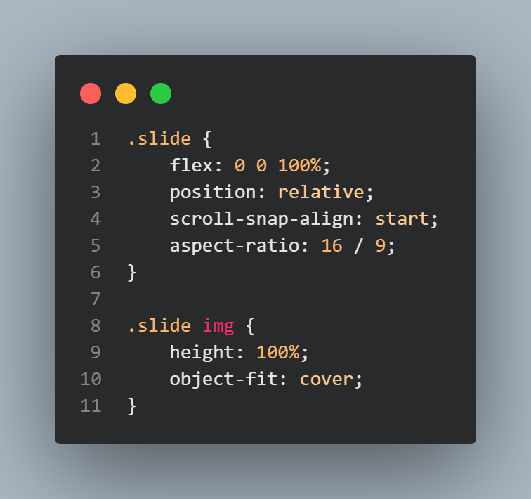
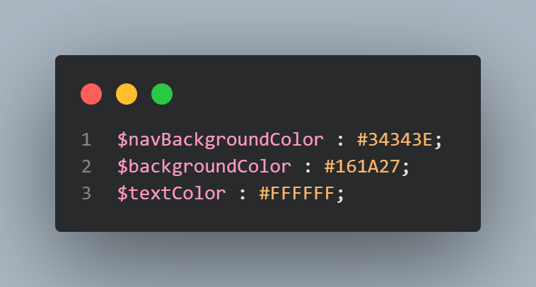
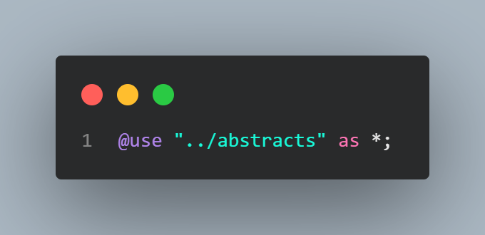
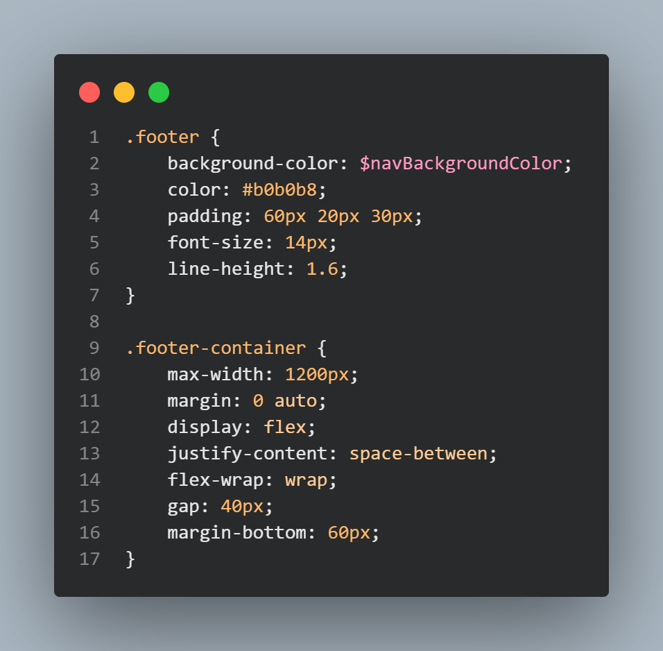
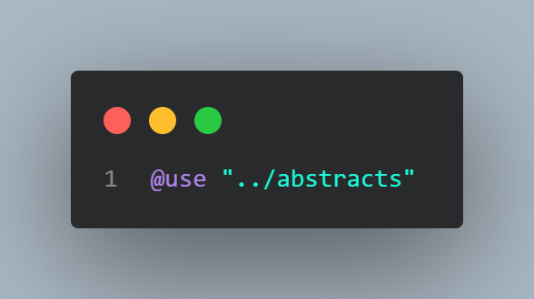

# 📖 Guide SCSS

> Dans ce guide vous allez tout apprendre sur les fonctionnalités que propose le SCSS.

---

## Sommaire :

#### 1. Informations *(C'est quoi SCSS ? Pourquoi l'utiliser ?)*
#### 2. Méthode BEM
#### 3. Préprocesseur, c'est quoi ?
#### 4. Architecture 7-1
#### 5. Installation : NPM & package manager
#### 6. Syntaxe SCSS
#### 7. Les variables
#### 8. Mixins
#### 9. Fonctions
#### 10. Collections — List & Map
#### 11. Boucles — `@for`, `@each`, `@while`
#### 12. Multi-fichiers — `@use` & `@forward`

---

## 1. Informations

 Qu'est ce que le SCSS ?

 Le SCSS est une forme avancée du CSS qui permet de mettre du style à vos pages web.

 Pourquoi se servir du SCSS ?

 Le SCSS est très intéressant car il permet de coder plus vite, ce qui est intéressant pour de grandes entreprises comme Amazon. Cela permet d'avoir un code optimisé et clair pour développer par la suite.

 ---

## 2. Méthode BEM

La méthode BEM est une façon claire et précise de nommer son code en SASS. Le but est d'avoir une structure compréhensible et réutilisable.

---

## 3. Préprocesseur, c'est quoi ?

---

## 4. Architecture 7-1

**1ère étape** : Créer un dossier avec le nom de votre travail.

**2ème étape** : Dans ce dossier, vous créez un dossier `assets`.

**3ème étape** : Dans le dossier `assets`, vous créez un dossier `sass` qui servira de stockage de votre code **SASS**. Vous faites le même processus si vous voulez utiliser du JavaScript dans votre code ou si vous voulez utiliser des images.

---

## 5. Installation : NPM & package manager

Pour pouvoir coder en SASS il vous faut un envrionnement de travail fait pour comme **Visual Studio Code**. Vous pouvez l'installer avec ce lien https://code.visualstudio.com/ ou si vous êtes sur **Windows**, vous pouvez l'installer depuis le **Microsoft Store**.

**1ère étape** : Une fois la structure terminée, nous pouvons lancer Visual Studio Code.

**2ème étape** : Cliquez sur `File` qui se trouve sur la barre de navigation en haut à gauche. Vous appuyez sur `New file` pour créer votre fichier `HTML`.

**3ème étape** : Une fois le fichier HTML créé, vous devez lancer le Terminal, pour ça vous pouvez soit utiliser le raccourci `CTRL + J` ou aussi `CTRL + SHIFT + ù` ou sinon dans la barre de navigation vous pouvez appuyer sur `Terminal` > `New Terminal`.

**4ème étape** : Dans le terminal, vous aller entrer cette commande pour l'installation de SASS : `npm i -d sass` et l'installation sera faite.

**Dernière étape** : Lorsque l'installation est finie, vous allez rentrer cette commande dans le Terminal : `npm run build`. Et voilà, maintenant vous pouvez coder en **SASS**.

⚠️ Il faudra utiliser la commande `npm run build` à chaque fois que vous ouvrez Visual Studio Code. 

---

## 6. Syntaxe SCSS

La syntaxe SCSS ressemble à celle du **CSS** sauf que celle du **SCSS** est bien meilleure que le **CSS**. Nous sommes beaucoup plus libre en **SCSS**. Nous avons la création de variables, de modules et de bases qui peuvent être utilisées plusieurs fois si on a plusieurs pages qui nécessitent le même code **SCSS**.

Voici un exemple de code en **SCSS** qui n'est pas possible en **CSS** :

Et voici ce que ça donne en **CSS** simple

Dans ces 2 exemples, nous pouvons voir que le **SCSS** est beaucoup plus adapté en terme de code et de vitesse.

---

## 7. Les variables

Les variables sont des éléments réutilisables qui permettent de gagner beaucoup de temps.

Dans votre dossier `abstracts` vous allez créer le fichier `_variables.scss` et vous aller définir vos variables.

**Exemple** :

En utilisant `@use` et en trouvant le chemin exact pour l'importer vous pourrez utiliser dans chaque fichier `scss` que vous allez créer. On parlera plus tard en détail de l'utilité exact du `@use`.

---

## 8. Mixins

---

## 9. Fonctions

Une fonction est un paramètre qu'on donne à une valeur.

---

## 10. Collections — List & Map

Les collections sont comme des bibliothèques de variables pour une fonctionnalité. Elles permettent par exemple de créer une liste de titres de votre site, par exemple en "Small", "Medium" et "Large".

---

## 11. Boucles — `@for`, `@each`, `@while`

Si vous avez déjà fait du code en `Python`, ces 3 noms vous sont familiers, mais si vous êtes nouveau en code, pas de problème tout sera expliqué.

Les boucles vous permettent de parcourir dans votre code pour l'optimiser.

---

## 12. Multi-fichiers — `@use` & `@forward`

Ces deux-là sont très important si vous avez plusieurs pages qui se ressemblent car elles permettent qu'on évite d'écrire plusieurs fois le même code dans un fichier à part. On peut les voir comme une forme d'import.

**Exemple** : voici un code réutilisable pour plusieurs pages

Code ici est utilisé pour les pieds de page, cela est donc intéressant de ne pas à le réécrire pour chaque page.

Pour se faire, dans le dossier `modules` vous allez créer un fichier `_footer.scss` mais ça peut bien être `_nav.scss` cela dépend de ce que vous voulez faire.

⚠️ Il est important de mettre "_" à chaque début du nom de fichier.

Ensuite, vous aller mettre tout votre code `SCSS` dans ce fichier que vous venez de créer.

Et pour chaque fichier `SCSS` pour sera créée vous aurez besoin `@use`

⚠️ Il faut bien faire choisir le chemin de votre module sinon il ne sera pas possible d'utiliser ce que vous voulez importer.

La bonne méthode ✅ :

La mauvaise méthode ❌ :

⚠️ Il est important de mettre `as *;` pour bien tout importer.

---

Voilà pour ce guide, vous avez toutes les clés en main pour pouvoir coder un site rapidement et structuré !